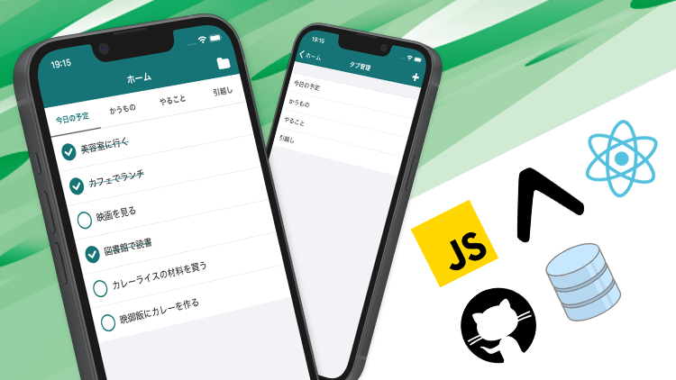

# React Native Todo List

## 概要

Udemyで公開している [【入門編】React Native & Expo でアプリ開発のスキルを身につける！](https://www.udemy.com/course/react-native-todo-list/?referralCode=EEFC5E1CAD43EB9DCA8C) の題材として使用する **React Native Todoリスト** アプリのリポジトリです。

Wikiには開発環境の構築方法やプロジェクトの作成方法、使用しているライブラリのインストール方法などを記載しています。

### Wiki目次

- [開発環境構築](https://github.com/sakes9/react-native-todo-list/wiki/%E9%96%8B%E7%99%BA%E7%92%B0%E5%A2%83%E6%A7%8B%E7%AF%89)

- [プロジェクト作成](https://github.com/sakes9/react-native-todo-list/wiki/%E3%83%97%E3%83%AD%E3%82%B8%E3%82%A7%E3%82%AF%E3%83%88%E4%BD%9C%E6%88%90)

- [ライブラリ](https://github.com/sakes9/react-native-todo-list/wiki/%E3%83%A9%E3%82%A4%E3%83%96%E3%83%A9%E3%83%AA)

- [React Native Debugger インストール](https://github.com/sakes9/react-native-todo-list/wiki/React-Native-Debugger)
